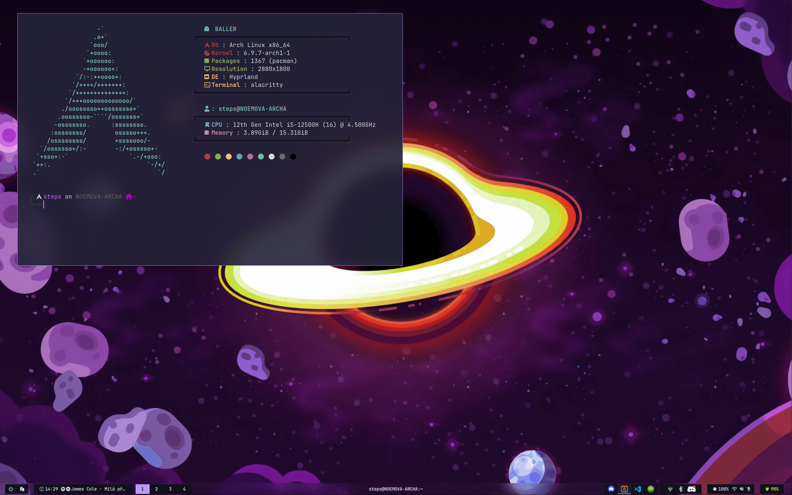

# [Hyprland](https://github.com/hyprwm/Hyprland)
Simple clean config for [hyprland](https://github.com/hyprwm/Hyprland). Inspired by **prasanthrangan's** [hyprdots](https://github.com/prasanthrangan/hyprdots?tab=GPL-3.0-1-ov-file)<br>

- [waybar](https://github.com/Alexays/Waybar) - Status bar
- [dunst](https://github.com/dunst-project/dunst) - Notification daemon
- [alacritty](https://github.com/alacritty/alacritty) - Terminal emulator
- [fzf](https://github.com/junegunn/fzf) - CLI fuzzy search, command history, files
- [fuzzel](https://codeberg.org/dnkl/fuzzel) - Application launcher
- [tuigreet](https://github.com/apognu/tuigreet) - TUI display manager
- [rofi](https://github.com/davatorium/rofi) - Clipboard history
- [oh-my-zsh](https://github.com/ohmyzsh/ohmyzsh/) - Configuration framework for [zsh](https://www.zsh.org/)
- [starship](https://github.com/starship/starship) - Shell prompt



# How to setup:

## Hyprland
Install `hyprland` wm based on you hardware configuration

## Install packages
```bash
yay -S $(cut -d '#' -f 1 package.lst)
```

## To enable **tuigreetd**
/etc/greetd/config.toml
```bash
[terminal]
# The VT to run the greeter on. Can be "next", "current" or a number
# designating the VT.
vt = 1

# The default session, also known as the greeter.
[default_session]

# `agreety` is the bundled agetty/login-lookalike. You can replace `/bin/sh`
# with whatever you want started, such as `sway`.
command = "tuigreet --cmd Hyprland --remember"

# The user to run the command as. The privileges this user must have depends
# on the greeter. A graphical greeter may for example require the user to be
# in the `video` group.
user = "greeter"
```

## For **GTK theme** set themes in:

**.config/** <br>
qt5ct.conf <br>
qt6ct.conf <br>
kvantum.kvconfig <br>
hypr/themes/theme.conf <br>

## GNU Stow
Apply configuration directly from this repo. Just place this dir to your `home` directory and use [stow](https://archlinux.org/packages/extra/any/stow/) 
```bash
stow --adopt .
```
